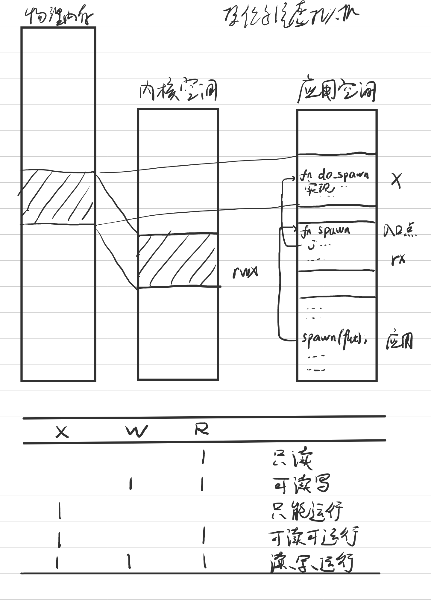
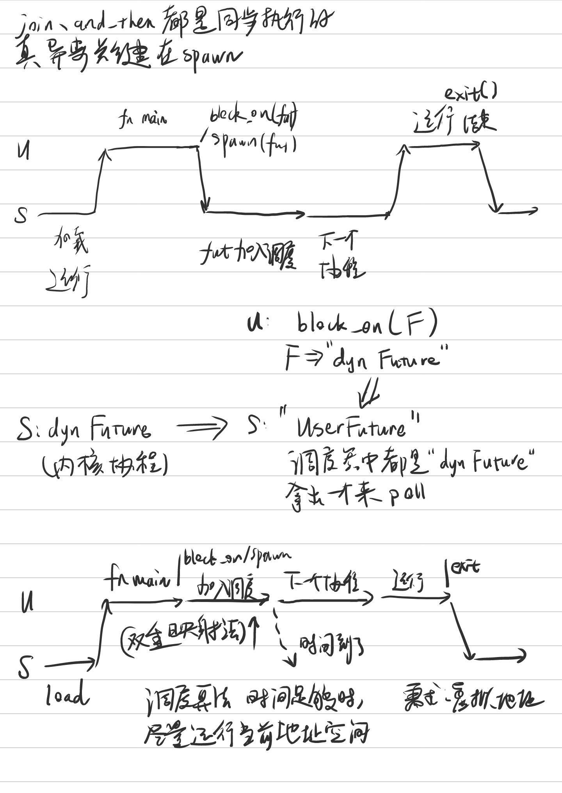

# 冬季异步内核项目

每天会根据自己的理解来记录，很可能后面的记录会推翻前面的看法。如果有不足之处，请多加指教。

## 第1天（1月19日）

大概启动了异步内核项目。我把基于async/await或者无栈协程的内核，叫做异步内核。

### 1. 异步内核中的协程

异步内核和传统的同步内核，差别在于：传统的内核通常提供线程，而异步内核期望在内核层面提供协程。
线程和协程的区别在于，线程需要运行较长的时间，要触发时间中断，让多个线程能并行地运行。
每当时间中断出现时，线程的上下文应当保存，然后取出下一个线程的上下文以供运行。
协程运行的时间较短，或许可以在一个时间片内完成。一个协程的运行完毕之后，它占有的栈就已经全部退出，所以协程之间的切换不需要保存上下文。

Rust语言的async/await和无栈协程是同一个概念。先看一个同步代码的例子。

```rust
async fn main() {
    let mut lazer_gun = LazerGun::new();
    lazer_gun.charge().await;
    for _ in 0..5 {
        lazer_gun.shoot().await;
    }
}
```

这段程序中出现了一个async，两个await。`async fn`定义的函数，都是异步执行的函数，
这是`fn(...) -> impl Future<Output = ...>`的语法糖缩写，将返回一个`Future`。
这个返回的结构体不会被执行，应当用`poll`去执行，我们通常不会直接去`poll`，
而是去使用`.await`语法。

`await`语法是一种语法糖，它的意义类似于：在异步操作无法立即完成时，让出当前的处理器时间，
将执行过程交由运行时环境。
所以上面的代码虽然运用了async/await语法，然而它依然是同步程序，仅仅是将程序打包为Future，并没有异步执行。
在这个基础上，我们虽然也能编写“join”、“and_then”两类Future，它仍然是同步执行的过程。

要想创建真正异步执行的协程，需要实现的关键操作是“spawn”。后续的工作重点之一就在这里，
需要编写一个协程调度器，它将代替传统的“__restore”函数，需要能完成“spawn”操作并启动，
在这之上编写用户和内核的切换。有了“spawn”，一个真正的协程就出现了。

### 2. 超时与外部中断

编写操作系统内核时，通常首先假设用户程序是正确无误的。但当协程的任务占用处理器过久，
在没有时钟中断的前提下，处理器只能运行这一个协程，一段时间无法响应其它的应用程序。
这就是超时问题，要解决这个问题，内核必须在占用时间过长的时候做出反应。

一种解决超时问题的方法，就是限定每个协程运行的最长时间。在最长的时间到达时，
操作系统内核立即中断，保存这个协程的上下文，把剩余的部分和其它的协程一起调度，继续运行。
这里，“线程”的思想就回来了。应用开发者基于协程内核开发时，知道如果协程占用时间过久，
调度性能在某种意义上就会退化到“线程”的水平，就知道应当使用异步开发的思路开发应用。

另一种比较应急的方法也能处理超时问题，就是在协程超时的时候，终止它所在的进程。
这之后协程的后续部分不再运行。这种方法属于底牌，尽量少用，应当用于一些必须让出资源的情况，
否则相比传统的操作系统内核，用户体验会非常不好。

外部中断可能出现在任何时候，它是操作系统和外界沟通的一部分，不能因为内核的性质变化了，
就忽视外部中断的处理流程。类似的思路，有两种针对外部中断的处理方法。
一种是直接中断当前的协程，保存上下文，然后立即调度处理外部中断的协程。
另一种是将外部中断的协程加入队列，然后继续运行当前的协程。第一种优点在于实时性好，
第二种优点在于上下文切换开销较小。

通常协程会被运行完毕，然而强制中断发生时，当前的协程只运行了一半。
这种运行到一半的状态，我叫它“半协程”。“半协程”就像线程一样被保存在内核中，
它包含了一个上下文，要调度到它的时候，不像普通协程一样直接可以运行，而应当先恢复上下文。
“半协程”的逻辑编写完毕后，可以用于对超时和外部中断的解决方案中。

### 3. 测试内核的调度效率

内核的调度效率可以使用一个数字表示，它代表一段时间内，用户程序运行的时间和总时间的比。
它是在0到1之间的一个小数，理想情况下，这个数字应当接近于1。
我们认为多道程序同时运行时，调度开销总是存在的，于是这个数字只能接近于1而不等于1。
它可以用来衡量内核的调度效率，越接近于1，说明内核的调度设计越好。

要在RISC-V下测试调度效率，有两个方案。一种是在内核里添加一个计数器。
计数器将在调度开始和结束时，记录下此时的时刻。
相减的差值就是应用和调度占用的时间，一段时间内累加计算，就能得到表示调度性能的数字。
还有一种方案是在SBI里添加计数器，不要把M层的时钟中断委托到S层，而是让M层在时钟中断发生时，
记下当时的时刻，随后再设置mie、mip等位，把中断手动分配给S层。剩下的思路和内核计数器相似。

两种方案的优劣是，第二种可以无缝更换内核，不需要重新编译，然而只适用于RISC-V平台。
第一种适用于更多的平台，然而需要重新编译和调试内核。

通过这些方案，我们最终得到表示内核调度开销的数字。我们编写同步和异步内核时，比较这个数字，
就能定量地说明不同内核在调度效率上的区别。

### 4. 面向应用层的异步内核

操作系统最终要承载大量的应用。对应用来说，系统调用是必要的渠道。
在基于线程的内核中，系统调用将会陷入内核，切换到内核线程，由它完成内核提供的系统调用功能；
这之后通过指令返回到用户态，继续运行用户的应用程序。

我们认为，基于协程的内核，系统调用也由协程处理。应用调用系统调用时，应用的协程仍然没有结束。
系统调用的协程结束后，内核将调度应用接下来的协程。

```rust
async fn count_audio_devices(token_str: &str) -> usize {
    // +++ Future开始
    let token_hash = hash_token(token_str); // 同步操作
    // 系统调用
    let mut cur = syscall(MODULE_AUDIO, LIST_AUDIO_DEVICES, token_hash).await;
    let mut ans = 0;
    while let Some(ptr) = cur { // 同步操作
        let nxt = unsafe { ptr.as_ref() };
        ans += 1;
        cur = nxt;
    }
    ans
    // --- Future结束
}
```

在RISC-V下，系统调用通过ecall指令实现。这里，“ecall”指令也是我们陷入内核的方法，
也顺便解决了上文中如何“让出资源”的问题；如果要构造生成器-让出模型，“ecall”就可以充当这里的让出操作。

陷入内核和结束陷入通常被认为是开销较大的操作。陷入和结束本身，可能只涉及到特权级的修改，
占大头的操作反而是保存上下文和切换虚拟内存空间。如果排除掉保存上下文的开销，
陷入和结束本身很可能是不需要很大开销的。这里的观点不是很成熟，需要对照硬件实现来校对和了解。

### 5. 未来的异步内核

现在的任务管理器里，通常出现“线程数”这个选项。这代表了当前的进程正在运行的线程。
未来，可能出现的是“每秒协程数”这样的情况。

所有的设备和文件系统都可以做成协程。希望异步内核得到验证后，能实际推出一些应用，
给出更多的测试，来获得更好的推广效果。

## 第2天（1月20日）

今天忙别的事情了，休息一天。

阅读了下面的文章：

- [两百行代码讲透Rust Futures](https://github.com/wyfcyx/osnotes/blob/master/Rust/future-in-200-lines.md)，由吴一凡学长翻译
- [异步Rust简介](https://github.com/wyfcyx/osnotes/blob/master/Rust/rust-async-introduction/rust-async-new.pdf)，吴一凡学长

先前对async/await的理解似乎不是很准确？明天继续做这一部分。

## 第3天（1月21日）

### 1. “sret”、“mret”指令的开销

这两条指令的硬件开销比较大，比“ld”、“sd”和还要大。主要的开销在于，“sret”等指令需要跳转到sepc的值，
还需要写好几个CSR寄存器。这就意味着在深流水线或乱序处理器中，“sret”需要刷洗流水线。
这就造成整个指令的开销较大。

感谢在计算所实习造处理核的车春池巨佬。

### 2. 共享调度器

目前实现协程的编程语言和技术中，调度器放在用户特权级。从应用看内核，这里的内核会提供一种I/O复用机制，
会出现两种典型的操作：应用向内核提交I/O请求，以及应用等待某个I/O请求结束。
这里，用户态会实现一个协程调度器，它根据内核提供的I/O复用机制，在用户态执行任务切换。
Linux下有一个较好的参考实现是io_uring，它的缓冲区通过共享内存和内核交互，节省了特权级切换的开销。

这次项目的目标之一是：内核和用户共享同一套调度器。调度器需要使用的内存空间和代码，相当于一个子系统。
在有虚拟空间的应用中，将调度器需要的函数共享到用户态的地址空间中。
RISC-V架构有“只可执行”页的设计，这一页的代码无法被用户读取，但是可以执行，这样就能运行调度算法了。
算法还需要读写共享的内存区域，这块区域暂时也被映射到页上，可以读和写。



未来为了安全考虑，调度器子系统应当被设定为可以重定向的代码。这之后，映射的地址就不确定了，
需要通过地址给定的“跳板”方法来运行。扫描整个地址空间也能得到函数的位置，然而地址空间非常大，
在“跳板”的代码只能执行，无法读的情况，扫描整个地址空间需要非常大的开销，或许可以防御针对调度器算法的攻击。
这种设计可以在调度器算法更新版本之后，代码不需要重新编译，仍然可以继续运行。



### 3. 启动异步内核

异步内核要求基于异步调度器运行。

```rust
fn kernel_main() -> ! {
    // 动态内存、中断等等
    // 资源的空间管理 let process = Process::new();
    let future = async {
        println!("shell > ");
        // 操作系统的第一个协程
    };
    let executor = Executor::new();
    executor.spawn(future);
    executor.run(); // 一直运行，直到队列没有协程，操作系统关闭
    sbi::shutdown()
}
```

后续整理用户层的代码，再来完善这个过程。

### 4. 一些感想

async/await的实现机制主要是“spawn”语法和以往语法的差别，和操作系统内核结合，
会有比较新的角度可以拓展。目前的步骤来看和传统内核仍然比较像，
希望后面做更多的步骤时，这两者的区别能体现出来。

RISC-V的向量中断等等目前还没有用上，也需要确认切换上下文开销是否可以省略。
这些都是后续需要先理清楚的内容。

## 第4天（1月22日）

### 1. 异步内核的优化点

相比传统内核，异步内核的性能提升可以这样归纳：

- 时间较长的上下文，因为切换开销较小，和传统内核性能相仿；
- 时间短的上下文，即使只需要运行很短的时间，传统的内核仍然需要进入内核的上下文切换过程；
- 协程内核期望包装“用户的Future”为异步任务，如果时间没到，就在用户层运行调度器，取出下一个协程；
- 这样能剩下大量切换上下文的时间。

我们认为有几点可以优化的地方：

1. 内核和用户共享调度器；
2. 在某些情况下，减少上下文切换本身的开销。

之前的想法是，把“yield”操作做成某种系统调用，然后针对这个调用来优化。
目前看来Rust的async/await好像不是这么一回事，这里存疑，后面查阅资料再来验证。

### 2. 共享调度器的安全性

内核提供调度器的代码和内存，跳转到代码并运行调度器，这段代码将会访问对应的内存。
要完成这一点，可以用页表的形式，用户和内核都映射同一块物理空间，这就通过共享内存完成共享调度器的任务。
这里共享调度器的想法要求目标处理器必须支持虚拟内存。在没有虚拟内存的情况下，
嵌入式芯片调度器本身只存在一个实例，跳转的时候当作普通函数，对RISC-V来说切换pmp寄存器，但不保存上下文，可能是一种解决方案。

这就引出一个问题：安全性。如果用户能接触到本被保护在内核中的调度器，用户就可以修改它，
从而开始攻击内核。要解决安全性问题，可以使用跳板法。将真正的调度器映射到可以读写、运行的页上，
然而这个页的虚拟地址在哪呢？操作系统随机生成，用户不知道。
如何访问不知道虚拟地址的调度器算法呢？这就可以生成另一张“跳板”页，这个页只可运行但不可读写，
程序跳转到这里后，能够跳转到真正的调度器里。
这个页里的代码就不能读取编码在内存里的真正的虚拟地址，因为这样需要“读”的权限。
在RISC-V下，这里的代码使用addi、shli、or计算高地址，最后使用jalr添加低地址并跳转。

要攻击这样的共享调度器内核，因为内存映射表被保护在内核特权级下，我们不能读取映射表，
最快的方法就有点像写杀毒软件的思路，但我们的内核就属于“守”的一方。

第一种思路是寻找调度器并针对性改写。先找到调度器的虚拟地址，然后针对它改写内存。
攻击者遍历内存，寻找某个特定偏移地址是否有某个值，或者计算一段地址内的校验和，
判断这是不是公开的内核代码的调度器。随机分配虚拟地址可以防止这类攻击，
因为虚拟空间太大了，即使攻击者知道页按4K等等分配，每4K一跳仍然是庞大的工作量。
时间有限的攻击者找不到调度器的虚拟地址。
这里的思路有点像windows下怎么找某个系统调用的函数地址。

第二种思路是攻击者无差别写入内存，使用海量进程自杀式攻击。攻击者不知道虚拟地址的情况下，
启动海量进程，随机或者顺序地对进程各自的内存地址发起修改指令，即使大量的进程会被系统终止，
最终攻击者将成功访问调度器的虚拟地址。攻击者向调度器的地址写入随机的信息，
因为所有进程的调度器是映射到同一个物理位置的，这个修改将影响整个系统的调度器。
面对这类攻击除了类似“军备竞赛”的行为分析，更好的防御方法还需要研究和思考。
另有一种程序运行中途重新分配调度器虚拟地址的“打枪换地方”法，但访问的概率而言，
对防御海量攻击法的效果有限。

“令牌法”可能适合解决上面的安全问题。“调度器的虚拟地址”是一个需要破解的维度，
如果它可以被遍历，可以增加需要遍历的维度。我们可以在“跳板”页写入特定的令牌值到寄存器，
这个值将被调度器的函数验证，验证通过后，才继续运行调度器的函数。
比如RISC-V的tp寄存器就可以用来存这样的东西。攻击者除了破解地址，还需要破解令牌，
就增加了攻击的难度。

内存安全是永远需要解决的问题，在内核的代码有保证之后，跨上下文的访问仍然需要内核开发者有效的把控。共享调度器的安全性就属于这一类问题。

### 3. 一些思考

今天完成了帧分配器的部分，后面就要接触到虚拟地址了。提前在草稿上规划内存布局，
方便后面内核的开发工作。

## 第5天（1月23日）

## 第6天（1月24日）

周末陪家里人了，休息。晚上修复了一个rustsbi的问题，过两天能发布0.1.1版本了。

## 第7天（1月25日）

完成了Sv39页表、内核自身的重映射。内核的起始地址暂时设定为`0xffffffffc0200000`。
预留了以帧为基础的重映射，给用户程序使用。

### 1. 共享调度器的代码实现

内核重映射写完之后，是时候考虑这一步了。先画出最简单实现的草稿，安全性在后面的工作中继续完善。

```rust
// 用户态
// SHARED_SCHEDULER - 可读写，与内核共享内存
static SHARED_SCHEDULER: SharedScheduler = { ... };
// SHARED_SLOT_TIMER - 只读（或只运行），用于获取当前的“stime”时间
static SHARED_SLOT_TIMER: SharedSlotTimer = { ... };
// 生成并发布一个新的任务；放在std::os::tornado::task::spawn位置上
fn spawn(future: impl Future<Output = ()>) {
    // 包装为任务。得到的结构体包含地址空间的编号
    let task = SharedTaskHandle::new_alloc(future);
    // 由SharedScheduler的具体的算法实现
    SHARED_SCHEDULER.lock().push_task(task);
}
// 把取出的任务重新放回队列里。需要标记为尽量在后面运行
fn push_task(task: SharedTaskHandle) {
    SHARED_SCHEDULER.lock().push_task(task);
} 
// 返回下一个要调度的任务。如果可能，尽量返回地址空间相同的任务
fn try_pop_task() -> TaskResult<SharedTaskHandle> {
    // 如果已经到达当前时间片的95%，说明当前进程已经调度大量比较小的协程
    // 此时应当尽可能切换到别的地址空间
    if SHARED_SLOT_TIMER.timed_up_ratio(95, 100) { 
        // 应当让出处理器资源，分配给别的地址空间
        TaskResult::should_yield()
    } else {
        // 尚未到达时间片的95%，尽量调度地址空间相同的任务
        let mut scheduler = SHARED_SCHEDULER.lock();
        if let Some(task) = scheduler.peek_task() {
            // 如果是其它上下文的任务
            if task.should_switch() {
                // 应当让出处理器资源，这里由内核执行真正的pop_task
                // 此处drop函数把scheduler的锁释放了
                return TaskResult::should_yield()
            }
            scheduler.pop_task(); // 因为锁上了，所以peek和pop操作的任务相同
            drop(scheduler); // 释放锁
            // 应当执行一个任务
            TaskResult::some_task(task)
        } else {
            // 如果已经没有任务了
            TaskResult::finished()
        }
    }
    // 另外，到达时间片的100%，会产生时钟中断，由内核处理上下文切换过程
    // 此时属于上下文过长的情况，运行速度相当于基于线程的内核
}
// 启动应用程序，会先启动的程序
fn start() -> ! { // 返回永无类型（never type）
    // 将异步的入口函数放入队列中
    let (sender, receiver) = sync::channel();
    spawn(async {
        let termination = main().await;
        sender.send(termination)
    });
    // 不断从队列拿出当前进程的任务。TaskResult可能是Task(task)、ShouldYield或Finished
    loop {
        match try_pop_task() {
            TaskResult::Task(task) => {
                // 造一个上下文，它将包含一个唤醒器
                let waker = waker_ref(&task); 
                let context = Context::from_waker(&*waker);
                // 调用SharedTaskHandle，得到里面包含的Future
                let mut future = task.get_future();
                // 唤醒这个Future
                let ret = future.poll(&mut context);
                // 如果Future返回了Pending，就把它再次加入队列中
                if let Poll::Pending = ret {
                    push_task(task);
                }
            },
            TaskResult::ShouldYield => {
                syscall::yield_now()
            },
            TaskResult::Finished => break // 已经结束了，退出控制流
        }
    }
    // 没有任务时，main函数一定返回了。使用系统调用陷入内核，退出程序
    let termination = receiver.receive(); // 此时接收器里面一定有一个值
    syscall::exit(termination)
}
// 入口函数
async fn main() {
    // 真正的程序逻辑在这里
}
```

然后是内核态部分。

```rust
// 内核态
fn syscall() {} // todo
```
